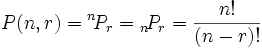
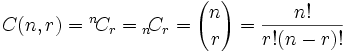

# PythonMath
## Here are some math formulas transformed to python code

### Σ SigmaPython
#### Usage
<pre>
	sigma.py #sigma(n, to)
</pre>
I love Sigma, it is fun to use, and can do many clever things.
#### Diagram:

### Permutations
#### Usage
<pre>
	permutaion.py #permutation(n, k)
</pre>
#### Formula

### Combination
#### Usage
<pre>
	combination.py #combination(n, k)
</pre>
#### Formula
